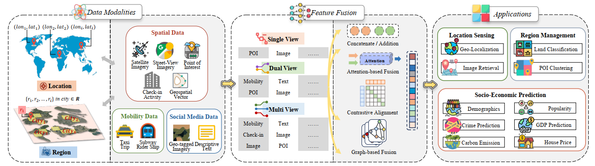
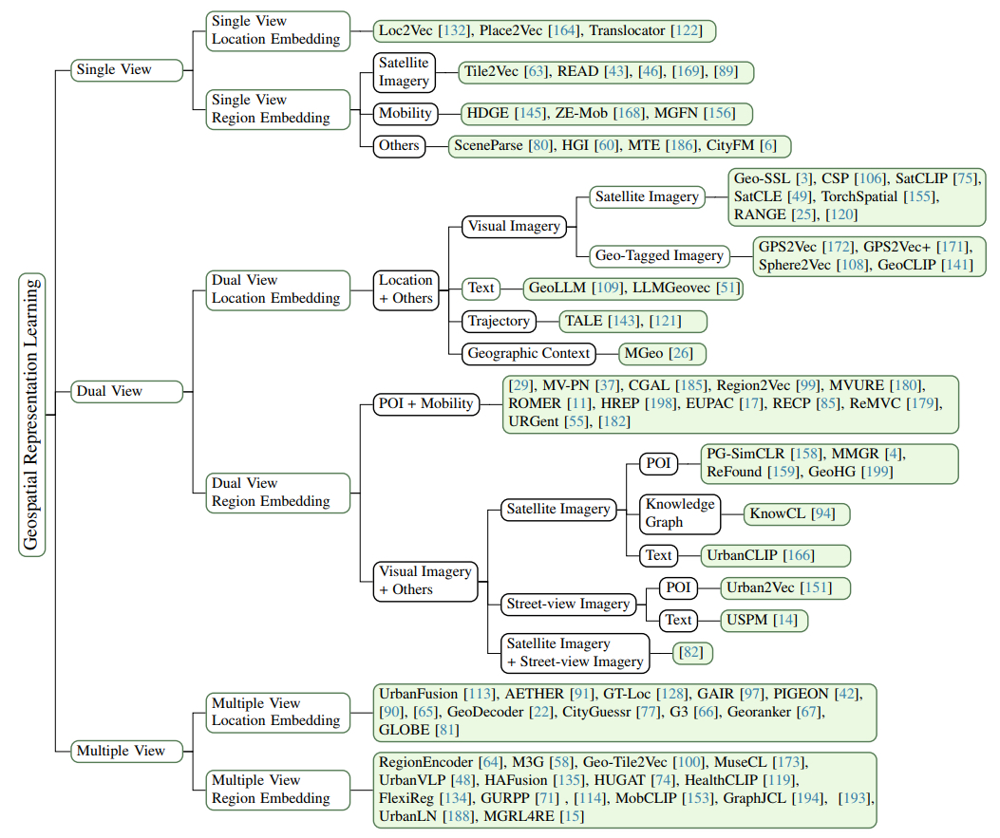
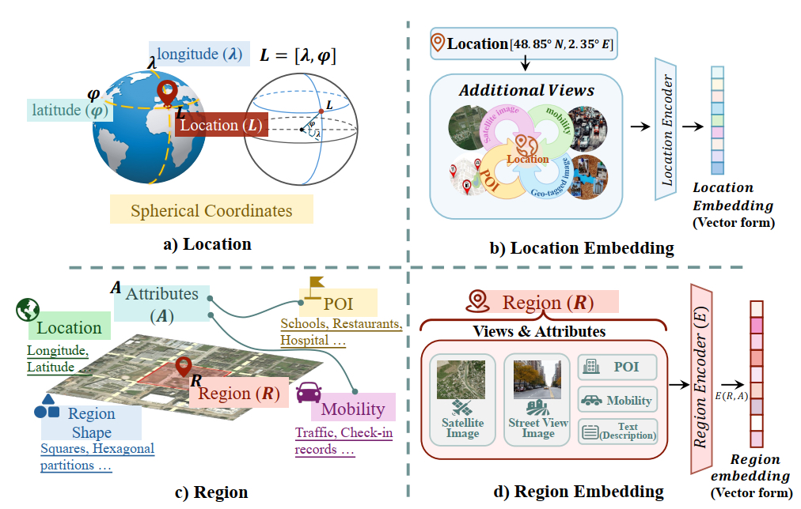
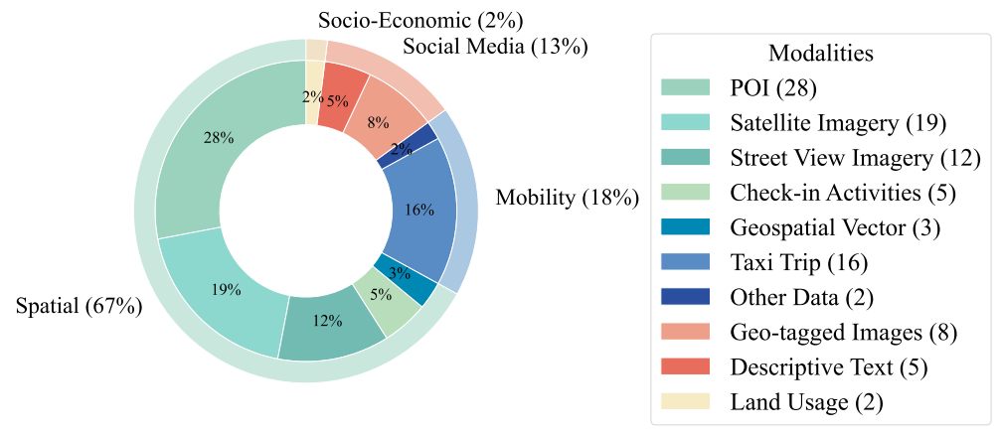
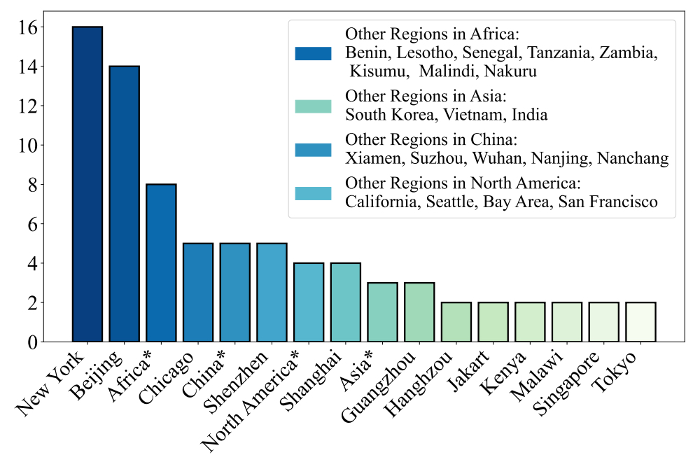

|<!--  -->

<!--    -->

# 
`Awesome Geospatial Representation Learning`

:star2:**A collection of papers, datasets, benchmarks, downstream tasks and codes for Geospatial Representation Learning Models. We are committed to consistently updating it to ensure it remains up-to-date and relevant.**

## 📢 Latest Updates
<!-- :fire::fire::fire: Last Updated on 2024.08.19 :fire::fire::fire: -->

- **2025.11**: Latest update.
- **2025.2**: Update project.
- **2024.12**: Initiate project.

## Related Surveys

- Self-supervised learning for geospatial ai: A survey. [[paper](https://arxiv.org/abs/2408.12133)]    *Information Fusion (2025)*

## Taxonomy Framework

We
systematically review recent advancements in geospatial representation learning (i.e., geospatial embedding), analyzing their
evolution and classifying methods into single-view, dual-view, and multiple-view approaches based on the complexity of views in learning geospatial representations

## Data Modality Perspective
- An illustration of concepts including location, location embedding,
region, and region embedding in geospatial representation learning.

-  The usage frequency of data modalities during learning stage across
four categories in the survey. 

- The dataset usage frequency across cities / countries in relevant papers.
We summarized the data separately by location and region.

## Methodology Perspective

<!DOCTYPE html>
<html>
<head>

</head>
<body>

<table>
  <thead>
  <tr>
    <th>Category</th>
    <th>Abbreviation</th>
    <th>Title</th>
    <th>Publication</th>
    <th>Paper</th>
    <th>Modality (Coverage)</th>
    <th>Methodology</th>
    <th>Downstream Tasks</th>
    <th>Code & Weights</th>
  </tr>
  </thead>
  <tbody>
  <tr>
    <td rowspan="53" class="category-cell">Urban Region Representation Learning</td>
    <td class="col-abbr">HDGE</td>
    <td>Region Representation Learning via Mobility Flow</td>
    <td class="col-center">CIKM2017</td>
    <td class="col-center"><a href="https://dl.acm.org/doi/pdf/10.1145/3132847.3133006" target="_blank">Paper</a></td>
    <td>Mobility  Data: Taxi data in Chicago  Downstream Task Data: Demographics data, Crime data, House price data</td>
    <td>graph, skip-gram</td>
    <td>Crime rate prediction, Average personal income and house price prediction</td>
    <td class="col-center">-</td>
  </tr>
  <tr>
    <td class="col-abbr">ZE-Mob</td>
    <td>Representing Urban Functions through Zone Embedding with Human Mobility Patterns</td>
    <td class="col-center">IJCAI2018</td>
    <td class="col-center"><a href="https://www.ijcai.org/Proceedings/2018/0545.pdf" target="_blank">Paper</a></td>
    <td>Mobility  New York</td>
    <td>co-concurrence + word2vec</td>
    <td>Identifying Functional Regions</td>
    <td class="col-center">-</td>
  </tr>
  <tr>
    <td class="col-abbr">CDAE</td>
    <td>Learning Urban Community Structures: A Collective Embedding Perspective with Periodic Spatial-temporal Mobility Graphs</td>
    <td class="col-center">ACM TITS2018</td>
    <td class="col-center"><a href="https://dl.acm.org/doi/pdf/10.1145/3209686" target="_blank">Paper</a></td>
    <td>Mobility+POI  data from Beijing</td>
    <td>graph + AutoEncoder</td>
    <td>Predicting Willingness to Pay  Spotting Vibrant Urban Communities</td>
    <td class="col-center">-</td>
  </tr>
  <tr>
    <td class="col-abbr">RegionEncoder</td>
    <td>Unsupervised Representation Learning of Spatial Data via Multimodal Embedding</td>
    <td class="col-center">CIKM2019</td>
    <td class="col-center"><a href="https://dl.acm.org/doi/pdf/10.1145/3357384.3358001" target="_blank">Paper</a></td>
    <td>Satellite Images+ Mobility Flow+ POI data.  coordinates  Chicago and NYC {Satellite Imagery: Google Static Maps API \ POI: Foursquare API \ Mobility: Open Data (Chicago and NYC)}</td>
    <td>graph + Denoising AutoEncoder + Discriminator</td>
    <td>Region Popularity Prediction  House Price Prediction</td>
    <td class="col-center"><a href="https://github.com/porterjenkins/region-encoder.git" target="_blank">Code</a></td>
  </tr>
  <tr>
    <td class="col-abbr">-</td>
    <td>Beyond Geo-First Law: Learning Spatial Representations via Integrated Autocorrelations and Complementarity</td>
    <td class="col-center">ICDM2019</td>
    <td class="col-center"><a href="https://ieeexplore.ieee.org/stamp/stamp.jsp?tp=&arnumber=8970913" target="_blank">Paper</a></td>
    <td>Mobility + POI (Beijing)  Mobility: A Beijing taxi company  POI: A business review site in China (dianping.com)</td>
    <td>Graph + Adversarial AutoEncoder (Inter+Intra)</td>
    <td>house sale amount prediction</td>
    <td class="col-center">-</td>
  </tr>
  <tr>
    <td class="col-abbr">Tile2Vec</td>
    <td>Tile2Vec: Unsupervised Representation Learning for Spatially Distributed Data</td>
    <td class="col-center">AAAI2019</td>
    <td class="col-center"><a href="https://dl.acm.org/doi/pdf/10.1609/aaai.v33i01.33013967" target="_blank">Paper</a></td>
    <td>Satellite img  America - USDA’s National Agriculture Imagery Program (NAIP)  Cropland Data Layer (CDL)</td>
    <td>Contrastive learning + triplet loss</td>
    <td>Land cover classification using aerial imagery  Predicting country health indices  Poverty prediction  Visual analogies</td>
    <td class="col-center"><a href="https://github.com/ermongroup/tile2vec" target="_blank">Code</a></td>
  </tr>
  <tr>
    <td class="col-abbr">MV-PN</td>
    <td>Efficient Region Embedding with Multi-View Spatial Networks: A Perspective of Locality-Constrained Spatial Autocorrelations</td>
    <td class="col-center">AAAI2019</td>
    <td class="col-center"><a href="https://dl.acm.org/doi/pdf/10.1609/aaai.v33i01.3301906" target="_blank">Paper</a></td>
    <td>POI + Mobility (Beijing)  NYC open data  Mobility: A Beijing taxi company  POI: A business review site in China (dianping.com)</td>
    <td>Multi-view graph + AutoEncoder</td>
    <td>regional mobility popularity - check-in counts</td>
    <td class="col-center"><a href="https://github.com/lslrh/multi-view" target="_blank">Code</a></td>
  </tr>
  <tr>
    <td class="col-abbr">-</td>
    <td>Learning to Interpret Satellite Images in Global Scale Using Wikipedia</td>
    <td class="col-center">IJCAI2019</td>
    <td class="col-center"><a href="https://arxiv.org/pdf/1905.02506" target="_blank">Paper</a></td>
    <td>Satellite Images  Wikipedia article  Building Dataset: WikiSatNet, around the world, from wikipedia</td>
    <td>DenseNet+Doc2Vec</td>
    <td>classification  temporal image classification  Land Cover Classification  Semantic Segmentation</td>
    <td class="col-center"><a href="https://github.com/Sungwon-Han/urban_score.git" target="_blank">Code</a></td>
  </tr>
  <tr>
    <td class="col-abbr">CGAL</td>
    <td>Unifying Inter-region Autocorrelation and Intra-region Structures for Spatial Embedding via Collective Adversarial Learning</td>
    <td class="col-center">KDD2019</td>
    <td class="col-center"><a href="https://dl.acm.org/doi/10.1145/3292500.3330972" target="_blank">Paper</a></td>
    <td>POI + Mobility(Beijing) NYC open dataMobility: A Beijing taxi company POI: A business review site in China (dianping.com)</td>
    <td>Multi-view Graph + Encoder-Decoder(GCN) + adversarial network</td>
    <td>PREDICTING REGIONAL POPULARITY - the number of mobile check-in events</td>
    <td class="col-center">-</td>
  </tr>
  <tr>
    <td class="col-abbr">-</td>
    <td>Predicting Economic Development using Geolocated Wikipedia Articles</td>
    <td class="col-center">KDD2019</td>
    <td class="col-center"><a href="https://dl.acm.org/doi/pdf/10.1145/3292500.3330784" target="_blank">Paper</a></td>
    <td>Wikipedia articles + Nightlight Images</td>
    <td>Doc2Vec + CNN</td>
    <td>Poverty Prediction,  EDUCATION INDEX PREDICTION</td>
    <td class="col-center"><a href="https://github.com/ermongroup/WikipediaPovertyMapping.git" target="_blank">Code</a></td>
  </tr>
  <tr>
    <td class="col-abbr">-</td>
    <td>Predicting Economic Growth by Region Embedding:A Multigraph Convolutional Network Approach</td>
    <td class="col-center">CIKM2020</td>
    <td class="col-center"><a href="https://dl.acm.org/doi/pdf/10.1145/3340531.3411882" target="_blank">Paper</a></td>
    <td>demographic, social, economic and housing  (America)</td>
    <td>Multi-graph Convolution Network</td>
    <td>Economic growth sector-by-sector predictions from ACS features of ZIP code areas</td>
    <td class="col-center">-</td>
  </tr>
  <tr>
    <td class="col-abbr">Urban2Vec</td>
    <td>Urban2Vec: Incorporating Street View Imagery and POIs for Multi-Modal Urban Neighborhood Embedding</td>
    <td class="col-center">AAAI2020</td>
    <td class="col-center"><a href="https://arxiv.org/pdf/2001.11101" target="_blank">Paper</a></td>
    <td>Street-view img (Google Street View Static API) + POI (Yelp Fusion API)   (Bay Area + Chicago + New York)</td>
    <td>Inception-V3 + Bag-of-Words</td>
    <td>Predicting demographic and socioeconomic attributes</td>
    <td class="col-center"><a href="https://github.com/wangzhecheng/urban2vec_.git" target="_blank">Code</a></td>
  </tr>
  <tr>
    <td class="col-abbr">GMEL</td>
    <td>Learning Geo-Contextual Embeddings for Commuting Flow Prediction</td>
    <td class="col-center">AAAI2020</td>
    <td class="col-center"><a href="https://cdn.aaai.org/ojs/5425/5425-13-8650-1-10-20200511.pdf" target="_blank">Paper</a></td>
    <td>urban indicators  mobility  NYC open data</td>
    <td>Graph. (node: urban indicators)</td>
    <td>commuting flow prediction</td>
    <td class="col-center"><a href="https://github.com/jackmiemie/GMEL" target="_blank">Code</a></td>
  </tr>
  <tr>
    <td class="col-abbr">READ</td>
    <td>Lightweight and Robust Representation of Economic Scales from Satellite Imagery</td>
    <td class="col-center">AAAI2020</td>
    <td class="col-center"><a href="https://aaai.org/papers/00428-lightweight-and-robust-representation-of-economic-scales-from-satellite-imagery/" target="_blank">Paper</a></td>
    <td>Satellite img  (Sparse labels)(South Korea)  from DigitalGlobe</td>
    <td>Mean Teacher + PCA</td>
    <td>purchasing power estimation</td>
    <td class="col-center"><a href="https://github.com/Sungwon-Han/READ" target="_blank">Code</a></td>
  </tr>
  <tr>
    <td class="col-abbr">-</td>
    <td>Learning to Score Economic Development from Satellite Imagery</td>
    <td class="col-center">KDD2020</td>
    <td class="col-center"><a href="https://dl.acm.org/doi/10.1145/3394486.3403347" target="_blank">Paper</a></td>
    <td>Imagenet on resnet18 for transfer learning  Image： ESRI  custom satellite images (South Korea, Malawi, and Vietnam)  data: Census data (Population and Gross Floor Area). Nighttime satellite imagery (optional)</td>
    <td>Clustering</td>
    <td>Change detection  Economic visual interpretation  Application to developing countries</td>
    <td class="col-center"><a href="https://github.com/Sungwon-Han/urban_score.git" target="_blank">Code</a></td>
  </tr>
  <tr>
    <td class="col-abbr">MVURE</td>
    <td>Multi-View Joint Graph Representation Learning for Urban Region Embedding</td>
    <td class="col-center">IJCAI2020</td>
    <td class="col-center"><a href="https://www.ijcai.org/Proceedings/2020/0611.pdf" target="_blank">Paper</a></td>
    <td>mobility, Region Attributes (Check-in and POI)(New York)</td>
    <td>multi-graph, including POI graph, check-in graph, source graph and destination graph</td>
    <td>land usage classification and crime prediction</td>
    <td class="col-center">-</td>
  </tr>
  <tr>
    <td class="col-abbr">-</td>
    <td>Using publicly available satellite imagery and deep learning to understand economic well-being in Africa</td>
    <td class="col-center">Nature Communications 2020</td>
    <td class="col-center"><a href="https://www.nature.com/articles/s41467-020-16185-w" target="_blank">Paper</a></td>
    <td>Satellite img: Landsat (daytime+nighttime)  Benin, Lesotho, Malawi, Rwanda, Sierra Leone, Senegal, Tanzania, and Zambia</td>
    <td>Resnet-18 + asset wealth index</td>
    <td>asset wealth estimation  social protection program  the relationship between temperature and wealth  satellite-estimated wealth distribution</td>
    <td class="col-center"><a href="https://github.com/sustainlabgroup/africa_poverty" target="_blank">Code</a></td>
  </tr>
  <tr>
    <td class="col-abbr">SceneParse</td>
    <td>Predicting Livelihood Indicators from Community-Generated Street-Level Imagery</td>
    <td class="col-center">AAAI2021</td>
    <td class="col-center"><a href="https://arxiv.org/pdf/2006.08661" target="_blank">Paper</a></td>
    <td>mapillary data (geotagged SVIs)</td>
    <td>Graph + cluster</td>
    <td>Poverty  Population  Women’s BMI</td>
    <td class="col-center"><a href="https://github.com/sustainlab-group/mapillarygcn" target="_blank">Code</a></td>
  </tr>
  <tr>
    <td class="col-abbr">M3G</td>
    <td>Learning Neighborhood Representation from Multi-Modal Multi-Graph: Image, Text, Mobility Graph and Beyond</td>
    <td class="col-center">AAAI2021</td>
    <td class="col-center"><a href="https://arxiv.org/pdf/2105.02489" target="_blank">Paper</a></td>
    <td>SVIs, POI, mobility  Chicago and New York City  Street-view Imagery: Google Street View Static API \ POIs: Yelp Fusion API</td>
    <td>Contrastive learning(Triplet loss)</td>
    <td>Predicting Demographics and Economics  Crime Prediction</td>
    <td class="col-center"><a href="https://github.com/tianyuanhuang/M3G" target="_blank">Code</a></td>
  </tr>
  <tr>
    <td class="col-abbr">HUGAT</td>
    <td>Effective Urban Region Representation Learning Using Heterogeneous Urban Graph Attention Network (HUGAT)</td>
    <td class="col-center">arxiv2022</td>
    <td class="col-center"><a href="https://arxiv.org/pdf/2202.09021" target="_blank">Paper</a></td>
    <td>POI, mobility (trip), check-in activities, land usage distribution.  Manhattan in NY</td>
    <td>Supervised learning,  multi-view graph: POIs, region, POI check-in time, hot hours for taxi departure, hot hours for taxi arrival</td>
    <td>crime, average personal income, and bike flow prediction</td>
    <td class="col-center">-</td>
  </tr>
  <tr>
    <td class="col-abbr">CcFTL</td>
    <td>A Cross-City Federated Transfer Learning Framework: A Case Study on Urban Region Profiling</td>
    <td class="col-center">arxiv2022</td>
    <td class="col-center"><a href="https://arxiv.org/pdf/2206.00007" target="_blank">Paper</a></td>
    <td></td>
    <td></td>
    <td></td>
    <td class="col-center">-</td>
  </tr>
  <tr>
    <td class="col-abbr">PG-SimCLR</td>
    <td>Beyond the First Law of Geography: Learning Representations of Satellite Imagery by Leveraging Point-of-Interests</td>
    <td class="col-center">WWW2022</td>
    <td class="col-center"><a href="https://dl.acm.org/doi/pdf/10.1145/3485447.3512149" target="_blank">Paper</a></td>
    <td>Satellite img + POI</td>
    <td>Contrastive Learning + Attention  (POI similar + geographically adjacent)</td>
    <td>Region Similarity Analysis (socioeconomic indicators prediction)</td>
    <td class="col-center"><a href="https://github.com/axin1301/satellite-imagery-POI" target="_blank">Code</a></td>
  </tr>
  <tr>
    <td class="col-abbr">-</td>
    <td>Predicting Multi-level Socioeconomic Indicators from Structural Urban Imagery</td>
    <td class="col-center">CIKM2022</td>
    <td class="col-center"><a href="https://dl.acm.org/doi/pdf/10.1145/3511808.3557153" target="_blank">Paper</a></td>
    <td>Satellite img + Street-view img  Satellite Imagery: Eris; Street-view Imagery: Baidu Map</td>
    <td>Graph + Contrastive learning</td>
    <td>transfer to other cities of socioeconomic indicator prediction((a) Commercial Activeness. (b) Number of POIs. (c) Economic Activity. (d) Resident Consumption. (e) Population.)</td>
    <td class="col-center">-</td>
  </tr>
  <tr>
    <td class="col-abbr">Region2Vec</td>
    <td>Urban Region Profiling via Multi-Graph Representation Learning</td>
    <td class="col-center">CIKM2022</td>
    <td class="col-center"><a href="https://dl.acm.org/doi/10.1145/3511808.3557720" target="_blank">Paper</a></td>
    <td>POI + mobility (taxi trip)  NYC Open Data</td>
    <td>multi-view graph, Encoder-Decoder (with attention)</td>
    <td>region clustering,  popularity prediction,  crime prediction</td>
    <td class="col-center">-</td>
  </tr>
  <tr>
    <td class="col-abbr">MGFN</td>
    <td>Multi-Graph Fusion Networks for Urban Region Embedding</td>
    <td class="col-center">IJCAI2022</td>
    <td class="col-center"><a href="https://arxiv.org/pdf/2201.09760" target="_blank">Paper</a></td>
    <td>Custom dataset (Mobility)  NYC Open Data</td>
    <td>Graph, Cluster, Attention</td>
    <td>crime count,  check-in count,  land usage type prediction.</td>
    <td class="col-center"><a href="https://github.com/wushangbin/MGFN" target="_blank">Code</a></td>
  </tr>
  <tr>
    <td class="col-abbr">URGENT</td>
    <td>Urban Region Profiling With Spatio-Temporal Graph Neural Networks</td>
    <td class="col-center">IEEE TCSS 2022</td>
    <td class="col-center"><a href="https://ieeexplore.ieee.org/document/9805695" target="_blank">Paper</a></td>
    <td>POI, traffic-status (speed, flow, demand)（Beijing+Hangzhou）  Mobility: GPS records in Beijing  POI: GaoDe public map API (https://lbs.amap.com/)</td>
    <td>Graph, Encoder-Decoder (Transformer)</td>
    <td>traffic prediction</td>
    <td class="col-center">-</td>
  </tr>
  <tr>
    <td class="col-abbr">ReMVC</td>
    <td>Region Embedding with Intra and Inter-View Contrastive Learning</td>
    <td class="col-center">TKDE2022</td>
    <td class="col-center"><a href="https://arxiv.org/pdf/2211.08975" target="_blank">Paper</a></td>
    <td>POI + Mobility(New York)</td>
    <td>Contrastive Learning (Inter and Intra view)</td>
    <td>Land Usage Clustering  Popularity Prediction</td>
    <td class="col-center">-</td>
  </tr>
  <tr>
    <td class="col-abbr">-</td>
    <td>Multi-modal Based Region Representation Learning Considering Mobility Data in Seoul</td>
    <td class="col-center">PCS2023</td>
    <td class="col-center"><a href="https://doi.org/10.1016/j.procs.2023.03.153" target="_blank">Paper</a></td>
    <td>mobility, poi  taxi trip  subway ridership data  District data  Downstream Tasks: Socioeconomic data  (South Korea) seoul</td>
    <td>GAT, construct two region graph: trip + subway</td>
    <td>the number of emplyees and mean house values prediction.</td>
    <td class="col-center">-</td>
  </tr>
  <tr>
    <td class="col-abbr">KnowCL</td>
    <td>Knowledge-infused Contrastive Learning for Urban Imagery-based Socioeconomic Prediction</td>
    <td class="col-center">WWW2023</td>
    <td class="col-center"><a href="https://dl.acm.org/doi/pdf/10.1145/3543507.3583876" target="_blank">Paper</a></td>
    <td>POI  mobility  images (satellite images - street view images)(Beijing, Shanghai, New York)</td>
    <td>Multi-view Graph, Contrastive Learning, ResNet  spatial graph: POI + region  mobility graph: flow  function graph: check-in POI (similarity)  business graph: POI</td>
    <td>trasfer to other cities for socioeconomic prediction (population economy crime)</td>
    <td class="col-center"><a href="https://github.com/quanweiliu/KnowCL" target="_blank">Code</a></td>
  </tr>
  <tr>
    <td class="col-abbr">Geo-Tile2Vec</td>
    <td>Geo-Tile2Vec: A Multi-Modal and Multi-Stage Embedding Framework for Urban Analytics</td>
    <td class="col-center">ACM TSAS 2023</td>
    <td class="col-center"><a href="https://dl.acm.org/doi/pdf/10.1145/3571741" target="_blank">Paper</a></td>
    <td>SVIs  POI  mobility  5th Ring Road of Beijing, downtown of Nanjing, and downtown of Nanchang</td>
    <td>Contrastive Learning   Based on destination, constructing context corpus</td>
    <td>main land use category classification task  restaurant average price regression task  firm number regression task  main POI category classification task</td>
    <td class="col-center">-</td>
  </tr>
  <tr>
    <td class="col-abbr">-</td>
    <td>Point-to-Region Co-learning for Poverty Mapping at High Resolution Using Satellite Imagery</td>
    <td class="col-center">AAAI2023</td>
    <td class="col-center"><a href="https://ojs.aaai.org/index.php/AAAI/article/view/26675" target="_blank">Paper</a></td>
    <td>satellite images  Kisumu, Malindi and Nakuru (Kenya) - Sentinel - 2  labels (low-income label)</td>
    <td>gate, attention, cnn</td>
    <td>Poverty Prediction</td>
    <td class="col-center">-</td>
  </tr>
  <tr>
    <td class="col-abbr">HREP</td>
    <td>Heterogeneous Region Embedding with Prompt Learning</td>
    <td class="col-center">AAAI2023</td>
    <td class="col-center"><a href="https://dl.acm.org/doi/abs/10.1609/aaai.v37i4.25625" target="_blank">Paper</a></td>
    <td>POI + Mobility(New York)</td>
    <td>Heterogeneous Graph: (node:region, edge: mobility (taxi trip) (source and target) + POI + geographic neighbor)</td>
    <td>land usage classification</td>
    <td class="col-center"><a href="https://github.com/slzhou-xy/HREP" target="_blank">Code</a></td>
  </tr>
  <tr>
    <td class="col-abbr">RegionDCL</td>
    <td>Urban Region Representation Learning with OpenStreetMap Building Footprints</td>
    <td class="col-center">KDD2023</td>
    <td class="col-center"><a href="https://dl.acm.org/doi/pdf/10.1145/3580305.3599538" target="_blank">Paper</a></td>
    <td>OSM building footprints + POI (Singapore + New York)</td>
    <td>Contrastive learning + transformer</td>
    <td>Land Use  Population Density Estimation  tranfer to other cities (Land Use and Population Density Estimation)</td>
    <td class="col-center"><a href="https://github.com/LightChaser666/RegionDCL" target="_blank">Code</a></td>
  </tr>
  <tr>
    <td class="col-abbr">C-MPGCN</td>
    <td>Learning Region Similarities via Graph-Based Deep Metric Learning</td>
    <td class="col-center">TKDE2023</td>
    <td class="col-center"><a href="https://ieeexplore.ieee.org/document/10064070" target="_blank">Paper</a></td>
    <td>POI  mobility  NYC open data</td>
    <td>multi-graph based on distance categories</td>
    <td>region similarity</td>
    <td class="col-center">-</td>
  </tr>
  <tr>
    <td class="col-abbr">-</td>
    <td>Urban visual intelligence: Uncovering hidden city profiles with street view images</td>
    <td class="col-center">PNAS2023</td>
    <td class="col-center"><a href="https://www.pnas.org/doi/10.1073/pnas.2220417120" target="_blank">Paper</a></td>
    <td>SVIs  Downstream Tasks: POI, geographical features, population...（US）</td>
    <td>LASSO regression, segmentation model</td>
    <td>outperforms dynamic population and transfer to other cities  crime,  health,  non-vehicle travel  poverty,  vehicle travel</td>
    <td class="col-center"><a href="https://github.com/brookefzy/urban-visual-intelligence.git" target="_blank">Code</a></td>
  </tr>
  <tr>
    <td class="col-abbr">HGI</td>
    <td>Learning urban region representations with POIs and hierarchical graph infomax</td>
    <td class="col-center">ISPRS(JPRS)</td>
    <td class="col-center"><a href="https://www.sciencedirect.com/science/article/pii/S0924271622003148" target="_blank">Paper</a></td>
    <td>Custom POI from baidumap (ShenZhen+Xiamen)</td>
    <td>Manifold learning + Graph + Self-attention + Contrastive learning</td>
    <td>estimating urban functional distributions, population density, and housing price.</td>
    <td class="col-center"><a href="https://github.com/RightBank/HGI" target="_blank">Code</a></td>
  </tr>
  <tr>
    <td class="col-abbr">MMGR</td>
    <td>Geographic mapping with unsupervised multi-modal representation learning from VHR images and POIs</td>
    <td class="col-center">JPRS2023</td>
    <td class="col-center"><a href="https://www.sciencedirect.com/science/article/pii/S0924271623001235" target="_blank">Paper</a></td>
    <td>very-high-resolution (VHR) image  POI (Wuhan+Shanghai)</td>
    <td>Contrastive learning + manifold learning + attention</td>
    <td>-</td>
    <td class="col-center"><a href="https://github.com/bailubin/MMGR.git" target="_blank">Code</a></td>
  </tr>
  <tr>
    <td class="col-abbr">ROMER</td>
    <td>Region-Wise Attentive Multi-View Representation Learning for Urban Region Embeddings</td>
    <td class="col-center">CIKM2023</td>
    <td class="col-center"><a href="https://doi.org/10.1145/3583780.3615194" target="_blank">Paper</a></td>
    <td>mobility, poi, check-in activities (New York)</td>
    <td>Multi-view graph: mobility (Origin, Destination), POI, check-in graph (Dynamic Graph)</td>
    <td>land usage classification task  check-in prediction</td>
    <td class="col-center">-</td>
  </tr>
  <tr>
    <td class="col-abbr">HAFusion</td>
    <td>Urban Region Representation Learning with Attentive Fusion</td>
    <td class="col-center">ICDE2024</td>
    <td class="col-center"><a href="https://arxiv.org/pdf/2312.04606" target="_blank">Paper</a></td>
    <td>POI + Mobility + Land use (NewYork，Chicago，San Francisco, Propose additional datasets: Chicago, San Francisco）</td>
    <td>multi-graph + self-attention</td>
    <td>crime preiction  check-in activity prediction</td>
    <td class="col-center"><a href="https://github.com/matt8707/ha-fusion" target="_blank">Code</a></td>
  </tr>
  <tr>
    <td class="col-abbr">ReCP</td>
    <td>Urban Region Embedding via Multi-View Contrastive Prediction</td>
    <td class="col-center">AAAI2024</td>
    <td class="col-center"><a href="https://arxiv.org/pdf/2312.09681" target="_blank">Paper</a></td>
    <td>POI + Mobility(New York)</td>
    <td>Contrastive learning + autoencoder</td>
    <td>Land Usage Clustering  Region Popularity Prediction</td>
    <td class="col-center">-</td>
  </tr>
  <tr>
    <td class="col-abbr">MuseCL</td>
    <td>MuseCL: Predicting Urban Socioeconomic Indicators via Multi-Semantic Contrastive Learning</td>
    <td class="col-center">IJCAI2024</td>
    <td class="col-center"><a href="https://arxiv.org/pdf/2407.09523" target="_blank">Paper</a></td>
    <td>Satellite img + Street-view img + POI + Mobility (Beijing,Shanghai,New York)  For street view imagery, we employ the Baidu Maps API1 for Beijing and Shanghai, and the Google Maps API2 for New York. High-resolution (3.6-meter) remote sensing images are acquired through ArcGIS for all three cities. The POI data for Beijing and Shanghai originates from Baidu Maps, while New York’s data is sourced from OpenStreetMap3 (OSM). Socioeconomic indicators, including population density from WorldPop4, housing data from Lianjia5, and crime data from NYC Open Data6, are also integrated.</td>
    <td>Contrastive learning + skip-gram + attention fusion</td>
    <td>-</td>
    <td class="col-center"><a href="https://github.com/XixianYong/MuseCL" target="_blank">Code</a></td>
  </tr>
  <tr>
    <td class="col-abbr">CGAP</td>
    <td>CGAP: Urban Region Representation Learning with Coarsened Graph Attention Pooling</td>
    <td class="col-center">IJCAI2024</td>
    <td class="col-center"><a href="https://www.ijcai.org/proceedings/2024/0832.pdf" target="_blank">Paper</a></td>
    <td>POI  mobility (taxi trip)  (New York-NYC open data)</td>
    <td>Graph + Self-attention</td>
    <td>crime prediction  check-in prediction</td>
    <td class="col-center">-</td>
  </tr>
  <tr>
    <td class="col-abbr">UrbanCLIP</td>
    <td>UrbanCLIP: Learning Text-enhanced Urban Region Profiling with Contrastive Language-Image Pretraining from the Web</td>
    <td class="col-center">WWW2024</td>
    <td class="col-center"><a href="https://dl.acm.org/doi/pdf/10.1145/3589334.3645378" target="_blank">Paper</a></td>
    <td>Satellite img + Text (generated)(Beijing,Shanghai,Guangzhou,Shenzhen)</td>
    <td>Contrastive learning + integrate text modality into urban region profiling</td>
    <td>1. Carbon 2. GDP 3. Population</td>
    <td class="col-center">-</td>
  </tr>
  <tr>
    <td class="col-abbr">UrbanVLP</td>
    <td>UrbanVLP: Multi-Granularity Vision-Language Pretraining for Urban Region Profiling</td>
    <td class="col-center">arxiv2024</td>
    <td class="col-center"><a href="https://arxiv.org/pdf/2403.16831" target="_blank">Paper</a></td>
    <td>Satellite img + Street-view img + Text (generated)(Beijing,Shanghai,Guangzhou,Shenzhen)</td>
    <td>macro (satellite) and micro (street-view) levels</td>
    <td>-</td>
    <td class="col-center">-</td>
  </tr>
  <tr>
    <td class="col-abbr">CityFM</td>
    <td>City Foundation Models for Learning General Purpose Representations from OpenStreetMap</td>
    <td class="col-center">CIKM2024</td>
    <td class="col-center"><a href="https://arxiv.org/pdf/2310.00583" target="_blank">Paper</a></td>
    <td>OSM: POI+building shape+road segments  OSM data (Node,Way,Relation)(tags as textual annotations) (traffic speed inference) (New York, Seattle)   building functionality classification (Singapore) population density estimation (Singapore, New York)</td>
    <td>Contrastive learning  Visual: resnet18-->visual embedding  Text: contrastive learning use POI  Road: positional encoding</td>
    <td>traffic speed inference;Building Functionality Classification  Population Density Estimation</td>
    <td class="col-center">-</td>
  </tr>
  <tr>
    <td class="col-abbr">MTE</td>
    <td>Urban region representation learning with human trajectories: a multi-view approach incorporating transition, spatial, and temporal perspectives</td>
    <td class="col-center">GISR2024</td>
    <td class="col-center"><a href="https://www.tandfonline.com/doi/full/10.1080/15481603.2024.2387392" target="_blank">Paper</a></td>
    <td>Trajectory（Shenzhen） Custom dataset from anonymous mobile phone location data</td>
    <td>graph + contrastive learning</td>
    <td>Similar location search  Land use classification  Population density estimation  land use classification</td>
    <td class="col-center"><a href="https://github.com/ZYuSdu/MTE" target="_blank">Code</a></td>
  </tr>
  <tr>
    <td class="col-abbr">ReFound</td>
    <td>ReFound: Crafting a Foundation Model for Urban Region Understanding upon Language and Visual Foundations</td>
    <td class="col-center">KDD2024</td>
    <td class="col-center"><a href="https://dl.acm.org/doi/pdf/10.1145/3637528.3671992" target="_blank">Paper</a></td>
    <td>Satellite img + POI (beijing，shangha，guangzhou，shenzhen，suzhou)</td>
    <td>Contrastive learning + knowledge distillation + self-attention</td>
    <td>1. Urban Village Detection 2.Commercial Activeness Prediction 3.Population Prediction</td>
    <td class="col-center">-</td>
  </tr>
  <tr>
    <td class="col-abbr">USPM</td>
    <td>Profiling Urban Streets: A Semi-Supervised Prediction Model Based on Street View Imagery and Spatial Topology</td>
    <td class="col-center">KDD2024</td>
    <td class="col-center"><a href="https://dl.acm.org/doi/10.1145/3637528.3671918" target="_blank">Paper</a></td>
    <td>Street labels  SVIs  +(text description generated)   Downstream Task: Socioeconomic Indicator Prediction (Wuhan)</td>
    <td>Contrastive learning + semi-supervised learning + graph</td>
    <td>Street Function Prediction  Socioeconomic Indicator Prediction</td>
    <td class="col-center">-</td>
  </tr>
  <tr>
    <td class="col-abbr">-</td>
    <td>secomanas2021seasonal</td>
    <td class="col-center">JATM2024</td>
    <td class="col-center"><a href="https://www.sciencedirect.com/science/article/pii/S0924271624003708" target="_blank">Paper</a></td>
    <td>Street-view img + (Social media) Check-in (+ Road Network)(Wuhan)</td>
    <td>urban street model: intra street + inter street;</td>
    <td>Traffic estimation   Traffic speed prediction   Traffic volume prediction</td>
    <td class="col-center"><a href="https://github.com/yemanzhongting/HybridGraph/tree/main" target="_blank">Code</a></td>
  </tr>
  <tr>
    <td class="col-abbr">GeoHG</td>
    <td>Learning Geospatial Region Embedding with Heterogeneous Graph</td>
    <td class="col-center">arxiv2024</td>
    <td class="col-center"><a href="https://arxiv.org/abs/2405.14135" target="_blank">Paper</a></td>
    <td>geo-entity segmentation + point-of-interest（POI）integration,   heterogeneous graph</td>
    <td>-</td>
    <td>-</td>
    <td class="col-center">-</td>
  </tr>
  <tr>
    <td class="col-abbr">EUPAC</td>
    <td>Enhanced Urban Region Profiling with Adversarial  Self-Supervised Learning for Robust Forecasting  and Security</td>
    <td class="col-center">arxiv2024</td>
    <td class="col-center"><a href="https://arxiv.org/abs/2402.01163" target="_blank">Paper</a></td>
    <td>mobility, POI,  NYC open data</td>
    <td>multi-graph: POI, mobility, geographical neighbor</td>
    <td>Check-in and crime prediction.  Land usage classification.</td>
    <td class="col-center">-</td>
  </tr>
  <tr>
    <td class="col-abbr">-</td>
    <td>Explainable Hierarchical Urban Representation Learning for Commuting Flow Prediction</td>
    <td class="col-center">SIGSpatial2024</td>
    <td class="col-center"><a href="https://dl.acm.org/doi/abs/10.1145/3678717.3691273" target="_blank">Paper</a></td>
    <td>grid:  Road Densities  POI  grid Population'  Railway Users  43 cities around the world.</td>
    <td>graph + self-attention</td>
    <td>Commuting Flows Reconstruction</td>
    <td class="col-center">-</td>
  </tr>
  <tr>
    <td class="col-abbr">Demo2Vec</td>
    <td>Demo2Vec: Learning Region Embedding with Demographic Information</td>
    <td class="col-center">GeoAI2024</td>
    <td class="col-center"><a href="https://dl.acm.org/doi/abs/10.1145/3687123.3698289" target="_blank">Paper</a></td>
    <td>population  mobility (taxi trip)  {NYC open data}  POI</td>
    <td>multi-view graph: Mobility (origin destination) POI, geographical neighbor, population  GCN+ self-attention + attentive-fusion --> embedding</td>
    <td>crime prediction  housing price prediction  check-in activity prediction</td>
    <td class="col-center">-</td>
  </tr>
  </tbody>
</table>

</body>
</html>

<!DOCTYPE html>
<html>
<head>

</head>
<body>

<table>
  <thead>
  <tr>
    <th>Category</th>
    <th>Abbreviation</th>
    <th>Title</th>
    <th>Publication</th>
    <th>Paper</th>
    <th>Modality (Coverage)</th>
    <th>Methodology</th>
    <th>Dataset</th>
    <th>Coverage</th>
    <th>Downstream Tasks</th>
    <th>Code & Weights</th>
  </tr>
  </thead>
  <tbody>
  
  <tr>
    <td rowspan="15" class="category-cell">Location Embedding</td>
    <td class="col-abbr">Place2Vec</td>
    <td>From ITDL to Place2Vec – Reasoning About Place Type Similarity and Relatedness by Learning Embeddings From Augmented Spatial Contexts</td>
    <td class="col-center">ACM SIGSPATIAL 2017</td>
    <td class="col-center"><a href="https://dl.acm.org/doi/pdf/10.1145/3139958.3140054" target="_blank">Paper</a></td>
    <td>POI (location + type)</td>
    <td>ITDL augmented spatial context （distance binned+ information theory）</td>
    <td>build dataset: Binary-based + Ranking-based</td>
    <td class="col-center">-</td>
    <td>POI type</td>
    <td class="col-center"><a href="https://github.com/BoYanSTKO/place2vec" target="_blank">Code</a></td>
  </tr>

  <tr>
    <td class="col-abbr">Loc2Vec</td>
    <td>Loc2Vec:Learning location embeddings with triplet-loss networks</td>
    <td class="col-center">Blog2018</td>
    <td class="col-center"><a href="https://sentiance.com/loc2vec-learning-location-embeddings-w-triplet-loss-networks" target="_blank">Paper</a></td>
    <td>location</td>
    <td>12-channel tensor, Spatial similarity + Self-supervised, Contrastive learning (triplet loss)</td>
    <td>1.5 million locations</td>
    <td>(data source：1 million locations that were visited by users on our platform, approximately 500,000 location fixes that were captured while users where in transport.)</td>
    <td>visualization</td>
    <td class="col-center"><a href="https://github.com/angus-spence/loc2vec" target="_blank">Code</a></td>
  </tr>

  <tr>
    <td class="col-abbr">Space2Vec</td>
    <td>MULTI-SCALE REPRESENTATION LEARNING FOR SPATIAL FEATURE DISTRIBUTIONS USING GRID CELLS</td>
    <td class="col-center">ICLR2020</td>
    <td class="col-center"><a href="https://arxiv.org/abs/2003.00824" target="_blank">Paper</a></td>
    <td>location + features(air quality, POI, elevation, mineral)</td>
    <td>self-supervised, (Point Feature Encoder(air quality, POI, elevation, mineral)、Point Space Encoder(multi-scale)、 Location Decoder、Spatial Context Decoder)</td>
    <td>open-source dataset published by   Yelp Data Challenge (partial)</td>
    <td>Las Vegas downtown area</td>
    <td>POI type</td>
    <td class="col-center"><a href="https://github.com/gengchenmai/space2vec" target="_blank">Code</a></td>
  </tr>

  <tr>
    <td class="col-abbr">GPS2Vec</td>
    <td>GPS2Vec: Pre-Trained Semantic Embeddings for Worldwide GPS Coordinates</td>
    <td class="col-center">IEEE TMM2021</td>
    <td class="col-center"><a href="https://ieeexplore.ieee.org/document/9360464" target="_blank">Paper</a></td>
    <td>Geo-tagged image / Check-ins / Tweets + location</td>
    <td>two-level grid-based framework</td>
    <td>venue semantic annotation & the geotagged image classification: Foursquare check-in records, one million Flickr images, (evaluate using NUS-WIDE)  next location prediction: -</td>
    <td>Flickr: global, 145 000 distinct users in over 100 countries  Foursquare check-in records: global,   trajectory：regional, New York and Los Angeles</td>
    <td>venue semantic annotation, the geotagged image classification, next location prediction</td>
    <td class="col-center">-</td>
  </tr>

  <tr>
    <td class="col-abbr">GPS2Vec+</td>
    <td>Learning Multi-context Aware Location Representations from Large-scale Geotagged Images</td>
    <td class="col-center">ACMMM2021</td>
    <td class="col-center"><a href="https://dl.acm.org/doi/10.1145/3474085.3475268" target="_blank">Paper</a></td>
    <td>Geo-tagged image + location</td>
    <td>multi-context fusion, location context(2-level grid) + visual context (RGB)</td>
    <td>image classification: Flickr, (evaluate using NUS-WIDE)   venue annotation: Foursquare check-ins</td>
    <td>Flickr: global, 145 000 distinct users in over 100 countries  Foursquare check-in records: global</td>
    <td>venue semantic annotation, geotagged image classification</td>
    <td class="col-center"><a href="https://github.com/yifangyin/GPS2Vec" target="_blank">Code</a></td>
  </tr>

  <tr>
    <td class="col-abbr">Geo-SSL</td>
    <td>Geography-Aware Self-Supervised Learning</td>
    <td class="col-center">ICCV2021</td>
    <td class="col-center"><a href="https://arxiv.org/abs/2011.09980" target="_blank">Paper</a></td>
    <td>Satellite image + location (as supervision signal)</td>
    <td>self-supervised, Contrastive learning, temporal positive pairs</td>
    <td>fMoW, GeoImageNet</td>
    <td>fMoW: global  GeoImageNet: global,</td>
    <td>geotagged image classification (Classifying Single Images + Classifying Temporal Data)</td>
    <td class="col-center"><a href="https://github.com/sustainlab-group/geography-aware-ssl" target="_blank">Code</a></td>
  </tr>

  <tr>
    <td class="col-abbr">TALE</td>
    <td>Pre-Training Time-Aware Location Embeddings from Spatial-Temporal Trajectories</td>
    <td class="col-center">TKDE2022</td>
    <td class="col-center"><a href="https://ieeexplore.ieee.org/abstract/document/9351627" target="_blank">Paper</a></td>
    <td>location + time(Trajectories)</td>
    <td>Spatial-Temporal, hierarchical tree structure</td>
    <td>Foursquare-NYC (Foursquare check-ins in New York), Foursquare-TKY (Tokyo) and Foursquare-JKT (Jakarta), Mobile-PEK(mobile phone signaling data in Beijing)</td>
    <td>New York, Tokyo and Jakart,  Mobile-PEK: Beijing</td>
    <td>Location Classification, Location Visitor Flow Prediction, Next Location Prediction</td>
    <td class="col-center"><a href="https://github.com/Logan-Lin/TALE" target="_blank">Code</a></td>
  </tr>

  <tr>
    <td class="col-abbr">-</td>
    <td>Pre-training Contextual Location Embeddings in Personal Trajectories via Efficient Hierarchical Location Representations</td>
    <td class="col-center">ECML PKDD2023</td>
    <td class="col-center"><a href="https://arxiv.org/abs/2310.01252" target="_blank">Paper</a></td>
    <td>location + time(Trajectories)</td>
    <td>Geo-Tokenizer (Multi-scale), Hierarchical Auto-regressive ( incorporated information from the lower-level hierarchies into the upper-level hierarchies)</td>
    <td>Mobile-T, Geo-Life</td>
    <td>Mobile-T:(collected by the base stations of the major cellular network operator）   Geo-Life：182 users over a period of five years in Microsoft Research  (Asia)</td>
    <td>Next Location Prediction, LandUsage Classification, Transportation Mode Classification</td>
    <td class="col-center">-</td>
  </tr>

  <tr>
    <td class="col-abbr">MGeo</td>
    <td>MGeo: Multi-Modal Geographic Language Model Pre-Training</td>
    <td class="col-center">SIGIR2023</td>
    <td class="col-center"><a href="https://arxiv.org/abs/2301.04283" target="_blank">Paper</a></td>
    <td>location + graphic object</td>
    <td>Geographic Encoder (contains features of the  surrounding geographic objects)</td>
    <td>GeoTES (Geographic Textual Similarity)</td>
    <td>GeoTES: (Hangzhou)  POI数据： obtained from the open-source OSM  Queries: manually generated by annotators</td>
    <td>Query-POI Matching (Ranking task + Retrieval task )</td>
    <td class="col-center"><a href="https://github.com/PhantomGrapes/Mgeo" target="_blank">Code</a></td>
  </tr>

  <tr>
    <td class="col-abbr">Sphere2Vec</td>
    <td>Sphere2Vec: Multi-Scale Representation Learning over a Spherical Surface for Geospatial Predictions</td>
    <td class="col-center">ISPRS2023</td>
    <td class="col-center"><a href="https://arxiv.org/abs/2201.10489" target="_blank">Paper</a></td>
    <td>Geo-tagged image + location</td>
    <td>encodes point coordinates on a spherical surface</td>
    <td>BirdSnap, BirdSnap+, Nabird+，iNat2017, iNat2018</td>
    <td>iNat2017: species classification, 5089 categories  iNat2018: species classification, 8142 categories  BirdSnap: no metadata, 500 bird species  BirdSnap+: supplemental metadata, 500 bird species  NABirds+: supplemental metadata,555 bird species</td>
    <td>geotagged image classification</td>
    <td class="col-center"><a href="https://github.com/gengchenmai/sphere2vec" target="_blank">Code</a></td>
  </tr>

  <tr>
    <td class="col-abbr">CSP</td>
    <td>CSP: Self-Supervised Contrastive Spatial Pre-Training for Geospatial-Visual Representations</td>
    <td class="col-center">ICML2023</td>
    <td class="col-center"><a href="https://arxiv.org/abs/2305.01118" target="_blank">Paper</a></td>
    <td>Satellite image / Geo-tagged image + location</td>
    <td>self-supervised, Contrastive learning</td>
    <td>iNat2018, fMoW</td>
    <td>iNat2018: species recognition, 8142 categories   fMoW: Satellite Image Classification, over 1 million images from over 200 countries</td>
    <td>Species Recognition, Satellite Image Classification</td>
    <td class="col-center"><a href="https://github.com/gengchenmai/csp" target="_blank">Code</a></td>
  </tr>

  <tr>
    <td class="col-abbr">GeoCLIP</td>
    <td>GeoCLIP: Clip-Inspired Alignment between Locations and Images for Effective Worldwide Geo-localization</td>
    <td class="col-center">NIPS2023</td>
    <td class="col-center"><a href="https://arxiv.org/abs/2309.16020v2" target="_blank">Paper</a></td>
    <td>Geo-tagged image + location</td>
    <td>contrasive learning, CLIP(Geo-tagged image - location), Random Fourier Features</td>
    <td>training: MediaEval Placing Tasks 2016 (MP-16),  testing: Im2GPS3k, Google World  Streets 15K dataset (GWS15k), YFCC26k</td>
    <td>MP-16: 4.72 million geotagged images from Flickr  Im2GPS3k: 3000 images from Im2GPS dataset   GWS15k: Global, (15,000 images from Google Street Map)  YFCC26k:26,000 images random selected from YFCC100M dataset</td>
    <td>image-to-GPS，limited data，Qualitative Results</td>
    <td class="col-center"><a href="https://github.com/VicenteVivan/geo-clip" target="_blank">Code</a></td>
  </tr>

  <tr>
    <td class="col-abbr">SatCLIP</td>
    <td>SatCLIP: Global, General-Purpose Location Embeddings with Satellite Imagery</td>
    <td class="col-center">arxiv2023</td>
    <td class="col-center"><a href="https://arxiv.org/html/2311.17179v3" target="_blank">Paper</a></td>
    <td>Satellite image + location</td>
    <td>contrasive learning, CLIP(Satellite image - location)</td>
    <td>pretrain: S2-100K  Downstream Tasks：  1) Air Temperature  2) Elevation  3) Median Income: U.S. election maps  4) California Housing: California Housing  5）Population Density  6） Biomes, Ecoregions  7) Countries  8) iNaturalist: iNat2017</td>
    <td>S2-100K: 100,000 multi-spectral satellite images and their corresponding locations (sampled approximately uniformly over landmass)   2）Elevation：obtained from the Google Static Maps API   3） U.S. election maps: including median income attribute   4) California Housing: obtained from the StatLib repository (20,640 observations on 9 variables)  6) Biomes, Ecoregions：global (all 846 terrestrial ecoregions, 14 terrestrial biomes)   7) Countries: self-built dataset  8) iNat2017: species classification, 5089 categories</td>
    <td>Regression (Air Temperature, Elevation, Median Income, California Housing, Population Density), Classification(Countries, iNaturalist, Biome, Ecoregions)</td>
    <td class="col-center"><a href="https://github.com/microsoft/satclip" target="_blank">Code</a></td>
  </tr>

  <tr>
    <td class="col-abbr">GeoLLM</td>
    <td>GEOLLM: EXTRACTING GEOSPATIAL KNOWLEDGE FROM LARGE LANGUAGE MODELS</td>
    <td class="col-center">ICLR2024</td>
    <td class="col-center"><a href="https://arxiv.org/abs/2310.06213" target="_blank">Paper</a></td>
    <td>OSM + text prompt (Address + Nearby Places)</td>
    <td>LLM, Address + Nearby Places ---> prompt</td>
    <td>1) Population: WorldPop   2) AssetWealth: DHS   3) Women Edu: DHS   4) Sanitaiton: DHS   5) Women BMI: DHS   6) Population: USCB   7) Mean Income: USCB  8) Hispanic Ratio: USCB  9) Home Value: Zillow</td>
    <td>1) WorldPop: global  2) DHS: ( Demo  graphic and Health Surveys) across 48 countries   3) USCB: (United States Census Bureau), America only  4) Zillow: (Zillow Home Value Index) only covers the US</td>
    <td>Regression (Population, Asset Wealth, Women Edu, Sanitation, Women BMI, Population, Mean Income, Hispanic Ratio, Home Value)</td>
    <td class="col-center"><a href="https://github.com/rohinmanvi/GeoLLM" target="_blank">Code</a></td>
  </tr>

  <tr>
    <td class="col-abbr">LLMGeovec</td>
    <td>Geolocation Representation from Large Language Models are Generic Enhancers for Spatio-Temporal Learning</td>
    <td class="col-center">AAAI 2025</td>
    <td class="col-center"><a href="https://arxiv.org/abs/2408.12116" target="_blank">Paper</a></td>
    <td>location+OSM data (addresses,nearby places)</td>
    <td>LLM, Address + Nearby Places ---> prompts</td>
    <td>1) AnnualAirTemperature: Chelsa   2) Annual Precipitation: Chelsa   3) Monthly Climate Moisture: Chelsa  4) Population Density: WorldPop  5) Nighttime Light Intensity: EOG  6) Human Modification Terrestrial: SEDAC  7) Global Gridded Relative Deprivation: SEDAC  8) Ratio of Built-up Area to Non-built Up Area: SEDAC  9) Child Dependency Ratio: SEDAC  10) Subnational Human Development: SEDAC  11) Infant Mortality Rates: SEDAC  12) Asset Index: DHS  13) Sanitation Index: DHS  14) Women BMI: DHS  15) Poverty Rate: DHS (Country)  16) Population Density: FaceBook(Country)  17) Women BMI: DHS(Country)  18）Population Density: NYC  19) Education Level: NYC  20) Income Level: NYC  21) Crime Rate: NYC</td>
    <td>1) Chelsa: Global  2) WorldPop：Global  3）EOG：Global  4) SEDAC: Global  5) DHS: Global  6) NYC: City (train1k, test424)</td>
    <td>geographic prediction, long-term time series forecasting, graph-based spatio-temporal forecasting</td>
    <td class="col-center">-</td>
  </tr>

  </tbody>
</table>

</body>
</html>

## Related Links

- [Awesome-Spatio-Temporal-Representation-Learning: Summary of Spatio-Temporal Representation Learning Models](https://github.com/aptx1231/Awesome-Spatio-Temporal-Representation-Learning)

- [Awesome-Multimodal-Urban-Computing](https://github.com/CityMind-Lab/Awesome-Multimodal-Urban-Computing)

- [Awesome-Urban-Foundation-Models](https://github.com/usail-hkust/Awesome-Urban-Foundation-Models)